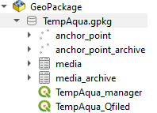
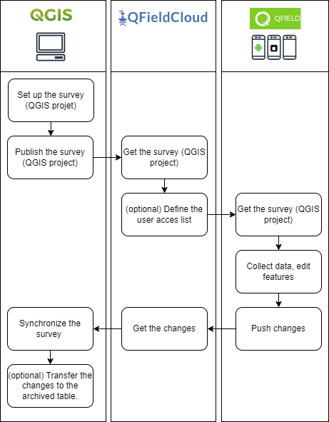
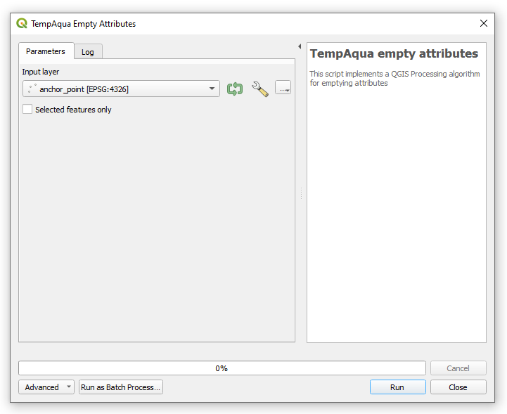
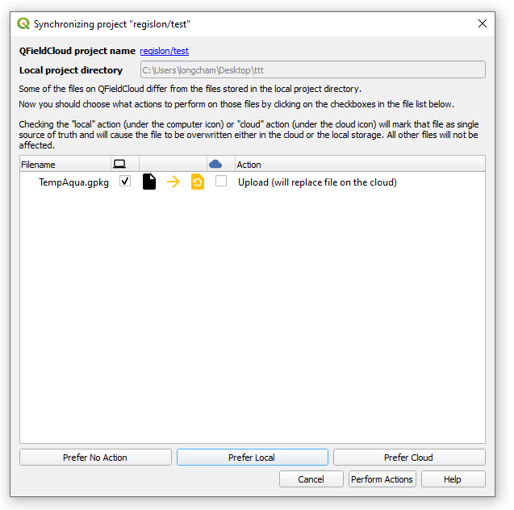
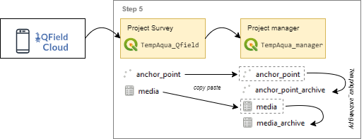
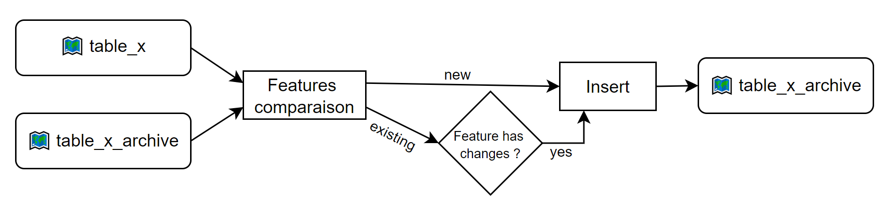
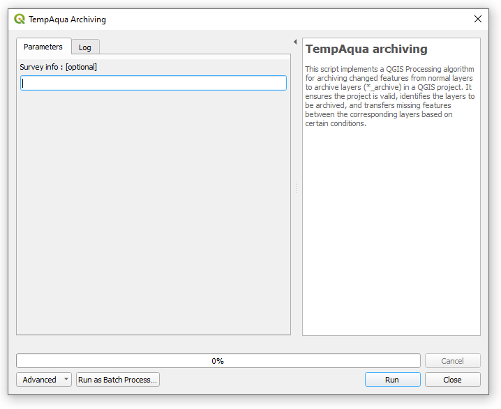

> [Main page](../README.md)

# User guide

This page give information on how to use the TempAqua application.

## Project content

The TempAqua QGIS projects and layers are included into the `/qgis/TempAqua.gpkg` geopackage. 

Two QGIS projects are available:
*   TempAqua_manager : This the project to gather data from field collection, it contains archived tables.

*  TempAqua_Qfield : This is the project to be used to set up mobile surveys. It contains the same layers as the TempAqua_manager project, but without the archived tables. It is also configured to be used with QFieldCloud.

## How to work with TempAqua ? 

To conduct a TempAqua Qfield survey, follow these steps:

1. Step 0: Initialize the QGIS project for the survey.
1. Step 1: Set up and publish the QGIS project to QFieldCloud.
1. Step 2: Manage the QGIS project on QFieldCloud.
1. Step 3: Collect data in the field with Qfield.
1. Step 4: Retrieve data from QFieldCloud to the local QGIS project.
1. Step 5: Archive the data (optional).

Schema of these steps :

## Step 0: Initialize the QGIS project for the survey.

📺 [Step 0 full video](https://raw.githubusercontent.com/TempAqua/TempAqua_App/main/doc/static/step0.mp4)
 

### Initial publication

> These few steps should only be performed once during the project initialization process.

1. Create an emplty folder where you want to store the project

2. Start QGIS (an empty project)

3. From QGIS, open the template project as follow : 
   
   - In QGIS > Browser > GeoPackage
     
   
   - Right click > New Connection ... > open `.../TempAqua_App/qgis/TempAqua_Qfield.gpkg`
   
   - In `TempAqua.gpkg` > Double click `TempAqua` to open the project
     
     Loading the TempAqua template project provides access to fictitious data that can be edited as desired.

4. Convert the project to QField project:
   
   - In QGIS > Browser > QFieldCloud > My projects
   - Right click > Create new project
     
   - Convert currently open project to cloud project (recommended)
   - Click next and fill the required information
   - Chose you local folder
   - Close QGIS

5. Fix cloud settings in project:
   
   - Open the newly created QGIS project
   - In Layers planel > Right click on the segments layer > Properties 
        
   - In QField tab > change Cloud layer action to `Directly access data source`

6. Push changes to QFieldCloud:
   
   - Save project
   - Menu `Plugins` > `QFieldSync` > `Synchronize Current Cloud Project`

## Step 1: Set up and publish the QGIS project to QFieldCloud.

### Remove existing attributes

> We developed a set of scripts to automate the data collection process. These scripts are located in the `/qgis/` folder. The following sections describe how to use these scripts. Installation process can be found [here](INSTALLATION.md).

This `TempAqua_empty_table.py` script allows the user to empty all attributes in a table except for the primary key and geometry. This can be useful when starting a new survey and wanting to clear the table to start from scratch while maintaining the measurement positions.

To run a script

1. double click on the script. The following window will appear:

2. Select the layer you want to empty.
3. Click on `Run` button. The script will run and a log will be displayed in the window. 

### Publish a existing QGIS project and data on QFieldCloud

> These few steps is performed when the QGIS project has already been published on QFieldCloud and you want to update it.

1. On GIS, click `Plugins` > `QFieldSync` > `Synchronize Current Cloud Project`

2. On the window that appears, click `Prefer Local` button. This will upload the local project to QFieldCloud and overwrite the existing project.

3. Click `Perform Action` button

   

## Step 2: Manage the QGIS project on QFieldCloud.

Please refer to the [official documentation](https://docs.qfield.org/get-started/tutorials/get-started-qfc/) for more information on how to manage QFieldCloud projects.

## Step 3: Collect data in the field with Qfield.

Please refer to the [official documentation](https://docs.qfield.org/get-started/) for more information on how to manage QField projects on the mobile devices.

## Step 4: Retrieve data from QFieldCloud to the local QGIS project.

To get the data from your field data collection, you need to download the data from QFieldCloud to QGIS. This is done as follow:

1. On GIS, click `Plugins` > `QFieldSync` > `Synchronize Current Cloud Project`

2. On the window that appears, click `Prefer Cloud` button. 

3. Click `Perform Action` button

## Step 5: Archive the data (optional).

After returning from the field, you may want to archive the data you collected. To do this, it is recommended that you create a separate project for archiving the data, rather than shipping it with the original field project.

We suggest using the `TempAqua_manager` project to archive the data. You can copy and paste the `anchor_point` and `media` layers into this project, and then run the `TempAqua_archiving.py` script to archive the data.

### Archive the survey data

> We developed a set of scripts `TempAqua_archiving.py`  to automate the data collection process. These scripts are located in the `/qgis/` folder. The following sections describe how to use these scripts. Installation process can be found [here](INSTALLATION.md).

This script copy the modified feature from one table to another one. 

To run a script

1. From the `QGIS survey project` copy the table you want to archive and paste it in the `QGIS manager project`. 
1. Double click on the script. The following window will appear:

1. Select the layer you want to archive.
1. Select the layer you want to use as archive.
1. Add optional information to be saved in the archived table. This information can be used to describe the survey or any changes made.
1. Click on `Run` button. The script will run and a log will be displayed in the window. The log will indicate the number of features that have been archived.

